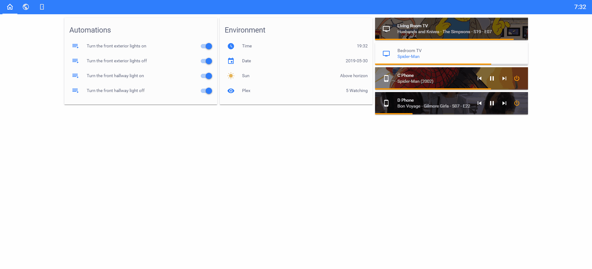

# Home Assistant Config

## System
[Raspberry Pi 3 B+](https://www.amazon.com/ELEMENT-Element14-Raspberry-Pi-Motherboard/dp/B07BDR5PDW).

I will attempt to update my configuration as new features are added.

If you enjoy viewing my configuration please be sure to :star2: my repository!

## Devices that I use with HA
  * [Aeotec Z-Stick Gen5](https://www.amazon.com/dp/B00X0AWA6E/) for Z-Wave control.
  * [GE Z-Wave Dimmer 14294](https://www.amazon.com/dp/B01MUCZA1C) for living room fan, bedroom fan, kitchen lights, and dining room lights.
  * [GE Z-Wave Fan Speed Control 3-Speed 14287](https://www.amazon.com/dp/B06XTKQTTV) for living room and bedroom fans.
  * [GE Z-Wave Light Switch 14291](https://www.amazon.com/dp/B01M1AHC3R) for exterior and interior hallway lights.
  * [GE Z-Wave Add-On Switch 12723](https://www.amazon.com/dp/B00RKJS8MQ) for interior hallway light traveler.
  * [Google Chromecast](https://www.amazon.com//dp/B015UKRNGS) [Configuration Instructions](https://www.home-assistant.io/components/cast/)

## My Home Assistant Dashboard
Here are some recent screenshots (please note that the time of your viewing that the README.md may not contain the up to date screenshots. They will be updated as changes are made.).

Front end themes and configuration may change periodically as I experiment.

### Home Screen DayMode

